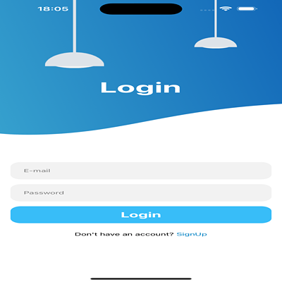
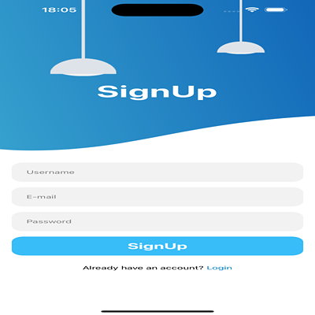

# React Natıve OneLogın Project

## React Native Authentication Application

This project is a simple React Native simplified authentication application. The application has login and sign up screens and animated transitions. React Navigation is used for transitions between screens and React Native Reanimated is used for animations.

## Features

### **1-React Navigation:**

@react-navigation-native is used to manage transitions between screens.

- **LoginScreen:** The home screen where users can log in.
- **SignUpScreen:** The home screen where users can log in.

### **2-React Native Reanimated:**

It is used to create smooth animations on login and registration screens. Screen elements (text fields, buttons, images) come to the screen with FadeInUp and FadeInDown animations.

### **3-Animated Interface:**

- **LoginScreen:** Animated lights, login form and buttons with fade-in animations.
- **SignUpScreen:** Similar animations specific to the recording screen.

### **4-Responsive Design:**

It adapts to different screen sizes using flexbox and percentage-based width and height.

### **5-Custom Background:**

Special background images are used to enhance the user experience on each screen.

### **6-Custom Background:**

- **App.js:** The main entry point of the application. Wraps the router in a NavigationContainer.
- **Router.js:** Stack Navigator, which manages the transition between login and registration screens.
- **LoginScreen.js:** It includes a login form and animated transitions.
- **SignUpScreen.js:** It includes the registration form and animated transitions.

### **7-Dependencies:**

- **React Navigation::** To navigate between screens.
- **React Native Reanimated:** For smooth and efficient animations.
- **React Native:** To create the mobile application.

### **8-Gif Image:**

### **9-Screenshot:**

