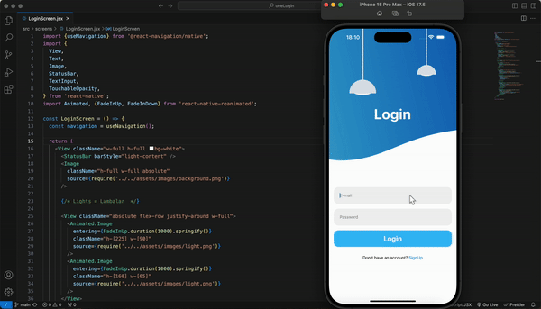

# React Natıve OneLogın Project

## (React Native Kimlik Doğrulama Uygulaması)

Bu proje, React Native kullanılarak oluşturulmuş basit bir kimlik doğrulama uygulamasıdır. Uygulama, giriş ve kayıt olma ekranlarına sahiptir ve animasyonlu geçişler içerir. Ekranlar arası geçiş için React Navigation, animasyonlar için ise React Native Reanimated kullanılmıştır.

## Özellikler

### **1-React Navigation:**

Ekranlar arası geçişleri yönetmek için @react-navigation-native kullanılmıştır.

- **LoginScreen:** Kullanıcıların giriş yapabileceği başlangıç ekranı.
- **SignUpScreen:** Kullanıcıların giriş yapabileceği başlangıç ekranı.

### **2-React Native Reanimated:**

Giriş ve kayıt ekranlarında pürüzsüz animasyonlar oluşturmak için kullanılmıştır. Ekran elemanları (yazı alanları, butonlar, resimler), FadeInUp ve FadeInDown animasyonları ile ekrana gelir.

### **3-Animasyonlu Arayüz:**

- **LoginScreen:** Animasyonlu ışıklar, giriş formu ve fade-in (belirme) animasyonları ile düğmeler.
- **SignUpScreen:** Kayıt ekranına özgü benzer animasyonlar.

### **4-Duyarlı Tasarım:**

Flexbox ve yüzde tabanlı genişlik ve yükseklik kullanılarak farklı ekran boyutlarına uyum sağlar.

### **5-Özel Arka Plan:**

Her ekranda kullanıcı deneyimini geliştirmek için özel arka plan görselleri kullanılmıştır.

### **6-Özel Arka Plan:**

- **App.js:** Uygulamanın ana giriş noktası. Router'ı NavigationContainer içine sarar.
- **Router.js:** Giriş ve kayıt ekranları arasında geçişi yöneten Stack Navigator.
- **LoginScreen.js:** Giriş formunu ve animasyonlu geçişleri içerir.
- **SignUpScreen.js:** Kayıt formunu ve animasyonlu geçişleri içerir.

### **7-Bağımlılıklar:**

- **React Navigation::** Ekranlar arasında geçiş sağlamak için.
- **React Native Reanimated:** Pürüzsüz ve performanslı animasyonlar için.
- **React Native:** Mobil uygulamayı oluşturmak için.

### **8-Ekran Görüntüsü:**

